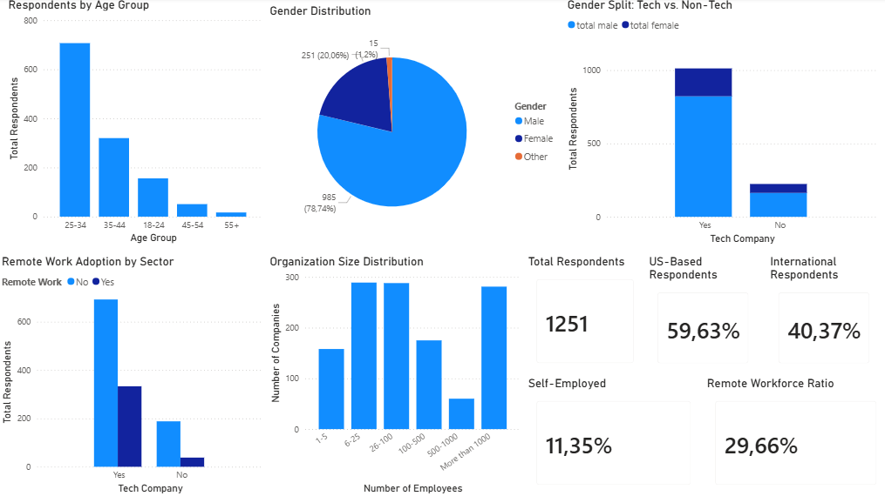
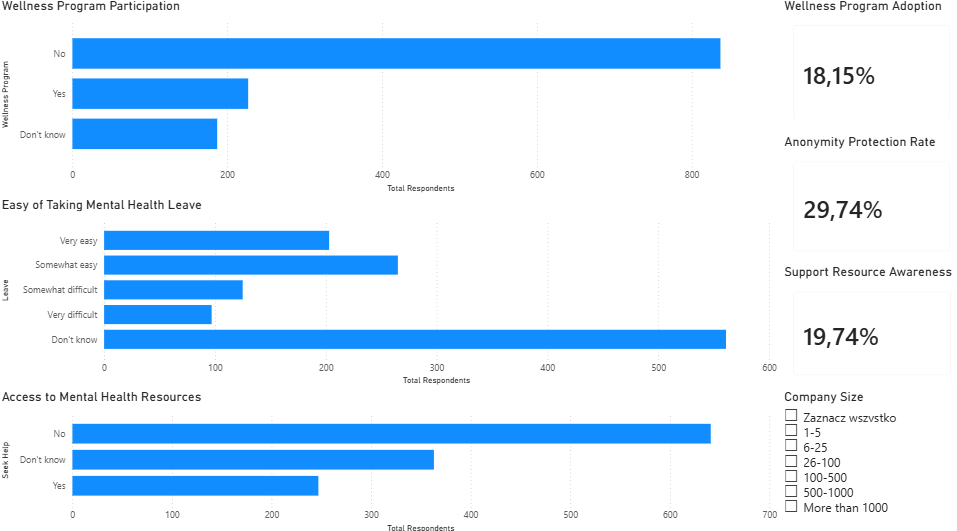
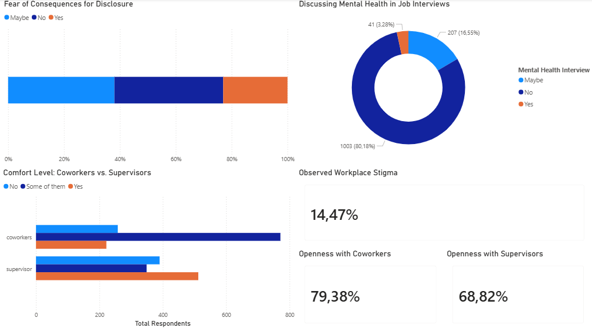
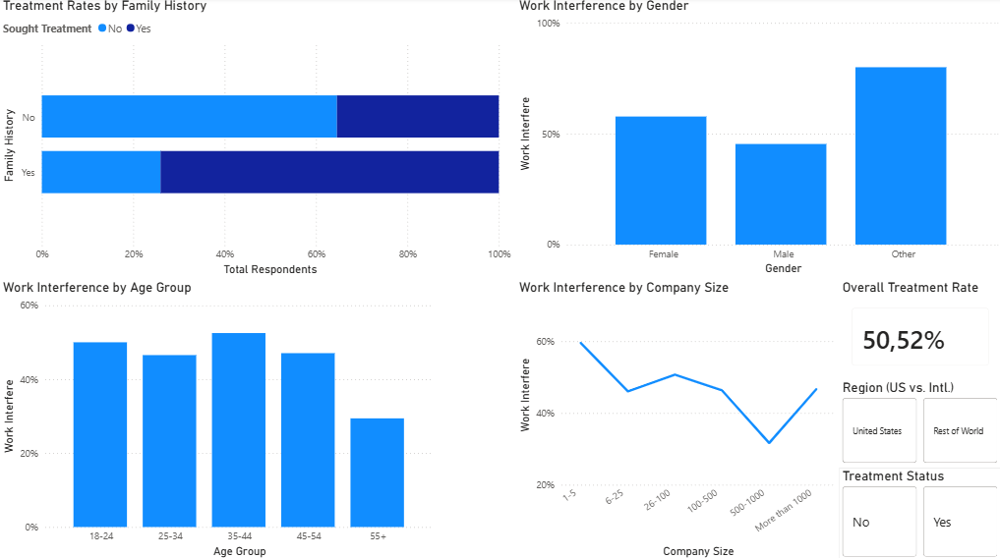

# 🧠 Mental Health in Tech Survey - Power BI Analysis

A comprehensive analysis of mental health in the technology industry based on 1,251 survey responses (2014-2016). This project explores the correlations between company size, employer support, and employee openness regarding mental health discussions.

---

## 📑 Report Overview

The report consists of 4 key analytical sections:

### 1. Who Are the Respondents (Demographics)
Analysis of the survey participant profile. The dominant age group is **25-34**, and the majority of respondents (nearly 60%) are based in the United States.
> **PREVIEW:** 

### 2. Employer Support
Investigating the availability of wellness programs and educational resources.
* **Key Insight:** Only **19.74%** of respondents are aware of the available support resources.
* Most employees are uncertain whether their anonymity is protected or if it is easy to take medical leave for mental health reasons.
> **PREVIEW:** 

### 3. Stigma & Barriers
Analyzing the comfort level of discussing mental health in a professional environment.
* Employees are more likely to talk to **coworkers (79.38%)** than to **supervisors (68.82%)**.
* Over 80% of respondents would not bring up mental health during a job interview.
> **PREVIEW:** 

### 4. Mental Health Outcomes (Impact on Work)
Examining the link between family history and treatment needs, and how mental health affects productivity (*Work Interference*).
* The average treatment rate stands at **50.52%**.
> **PREVIEW:** 

---

## 🛠️ ETL Process (Data Transformation)
Raw CSV data from Kaggle required extensive cleaning in **Power Query**:

* **Gender Normalization:** Reduced 49 unique entries into three categories: *Male/Female/Other* (using `Text.Lower` and `Text.Contains`).
* **Age Cleaning:** Filtered out errors (restricted to the 18-72 age range).
* **Handling Missing Values:** Replaced text "NA" with `null` values in the `work_interfere` column.
* **Business Logic:**
    * Created age groups (`age_group`).
    * Introduced a sorting column for company size (`no_employees_sort`) to ensure logical chart sorting.
    * **Unpivot:** Transformed communication-related columns (coworkers/supervisor) into a separate table to enable comparative bar chart visualizations.

---

## 💡 Recommendations

1. **Increase Awareness:** Companies should invest in information campaigns, as nearly 20% of employees do not know how to seek help.
2. **Managerial Education:** The lower level of trust in supervisors (68% vs. 79% for peers) suggests a need for empathy and support training for managers.
3. **Leave Transparency:** Clear and transparent rules for taking mental health days can significantly reduce employee stress.

---

## 🚀 How to Use This Project

1. Download the `Mental_Health_Analysis.pbix` file from the main folder.
2. Open it using **Power BI Desktop**.
3. All data is pre-loaded into the model (Import Mode).

**Author:** Rafał Baryłka
